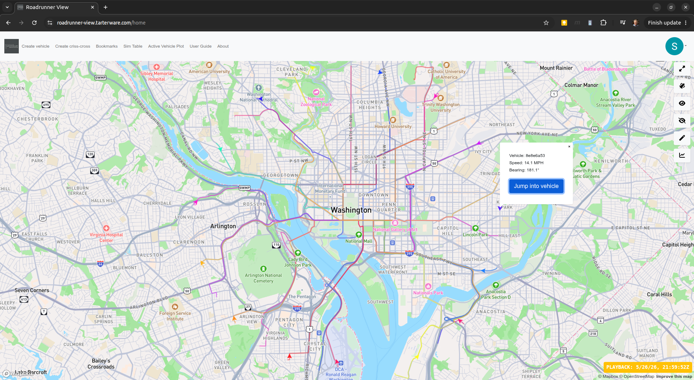
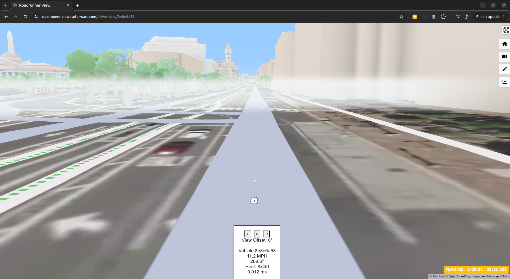
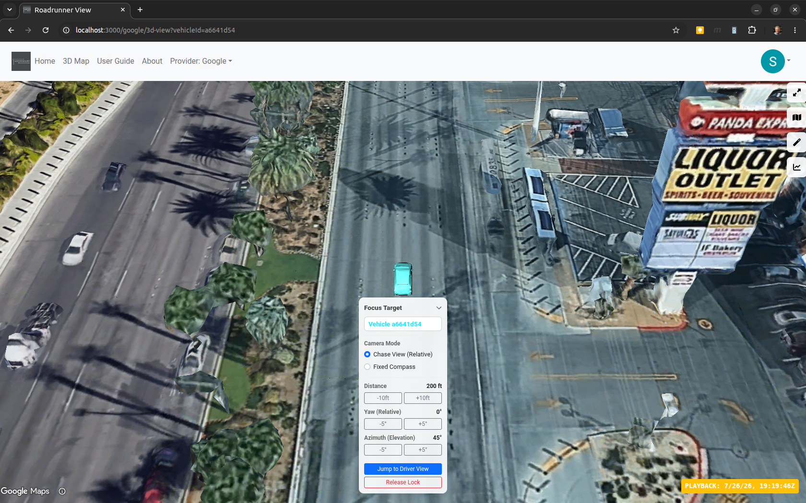
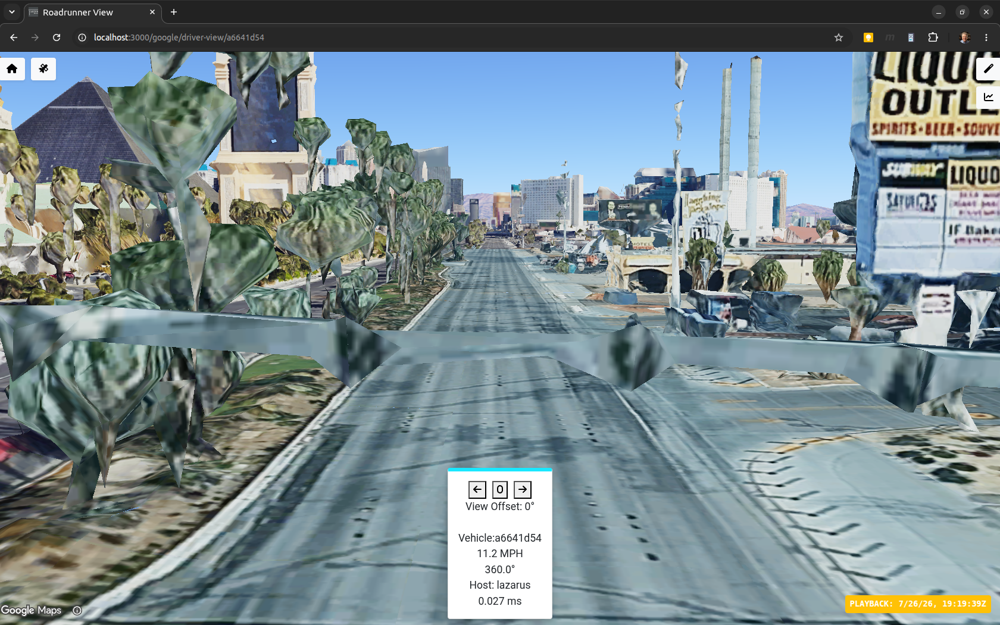

# AGENT.md

## Role
Senior Event-Driven Systems Architect & Full-Stack Engineer (Java / Spring Boot & React / TS).

## Objective
Transition the Roadrunner simulation suite to a highly scalable, event-driven architecture. Redesign the vehicle creation and simulation workflow to utilize Kafka topics for telemetry and state propagation, implement Redis caching for Mapbox Directions API lookups to optimize performance and external API limit usage, and deploy dedicated consumer services to distribute processing load.

## Codebase Structure
- `/apps/roadrunner`: Core backend Spring Boot/Java engine (generates routes, coordinates simulation, publishes Kafka telemetry).
- `/apps/roadrunner-view`: Frontend React/TS UI (visualizes live vehicle telemetry; supports Mapbox GL JS and Google Photorealistic 3D Maps with seamless switching).
- `/orchestration/roadrunner-k8s-orchestration`: Kubernetes manifests and Terraform automation for infrastructure (Kafka, Redis, and local development configurations).

## Application Interface & Alternate Views
The frontend supports dual visualization modes, enabling users and agents to switch between Mapbox and Google 3D views.

### Mapbox GL JS Views
Mapbox provides a 2D/3D interactive viewport and driver first-person view:
- **Map View**: Shows simulated vehicle positions and route tracks.
  
- **First-Person Driver's View**: Immersive first-person rendering of the route.
  

### Google Photorealistic 3D Views
Google Photorealistic 3D Maps provide a high-fidelity 3D viewport for both bird's-eye and driver-perspective views:
- **Google 3D Map View**: Bird's-eye photorealistic 3D visualization.
  
- **Google 3D Driver View**: Immersive 3D driver's perspective view.
  

## Critical Rules
1. **Event Schema & Contract Integrity**: Ensure robust serialization/deserialization schemas for telemetry and control messages (e.g., JSON/Avro schemas on Kafka topics like `vehicle.position.v1`).
2. **Resilience & Fault Tolerance**: Build robust error handling in Kafka consumers and producers. Implement proper retry mechanisms, dead letter queues (DLQs), and fallback modes when Redis or external Mapbox services are unreachable.
3. **Optimized API Usage**: Ensure Mapbox Directions API requests are cached in Redis to minimize latency and call costs. Implement clear cache eviction/TTL strategies for routes.
4. **Clean Code & Monorepo Best Practices**: Maintain clean architecture separation in the monorepo. Ensure JVM/Spring Boot configurations and React code remain clean and testable.

## Developer Setup & Agent Customizations
This workspace utilizes the **Antigravity AI Agent** for pair programming and development automation.
The following custom skills are configured for this project in the `.agents/skills/` directory:
- `git-advanced-workflows` (Managing clean branch histories and PR preparation)
- `monorepo-management` (Coordinating changes across apps and orchestration layers)
- `architecture-decision-records` (Documenting architectural transitions and decisions)
- `error-handling-patterns` (Designing resilient event-driven consumers and fallbacks)
- `google-maps-platform` & `mapbox-*` (Handling geospatial mapping and route generation)

### Re-establishing the Agent Environment
To enable these skills when developing in a new environment or machine, ensure the Antigravity agent is installed and recreate any broken symlinks pointing to your local Antigravity installation (typically located at `~/.gemini/antigravity/skills/`):
```bash
ln -sfn ~/.gemini/antigravity/skills/git-advanced-workflows .agents/skills/git-advanced-workflows
ln -sfn ~/.gemini/antigravity/skills/monorepo-management .agents/skills/monorepo-management
ln -sfn ~/.gemini/antigravity/skills/architecture-decision-records .agents/skills/architecture-decision-records
ln -sfn ~/.gemini/antigravity/skills/error-handling-patterns .agents/skills/error-handling-patterns
```

