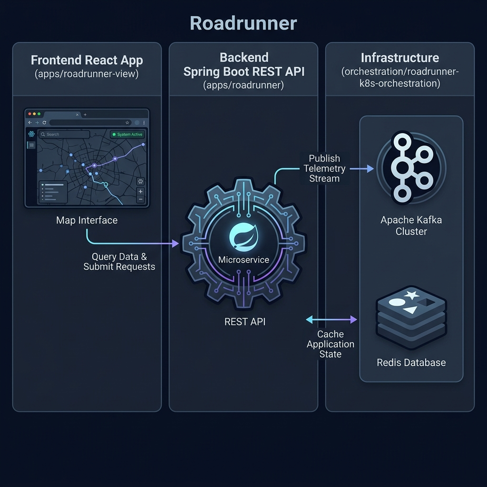
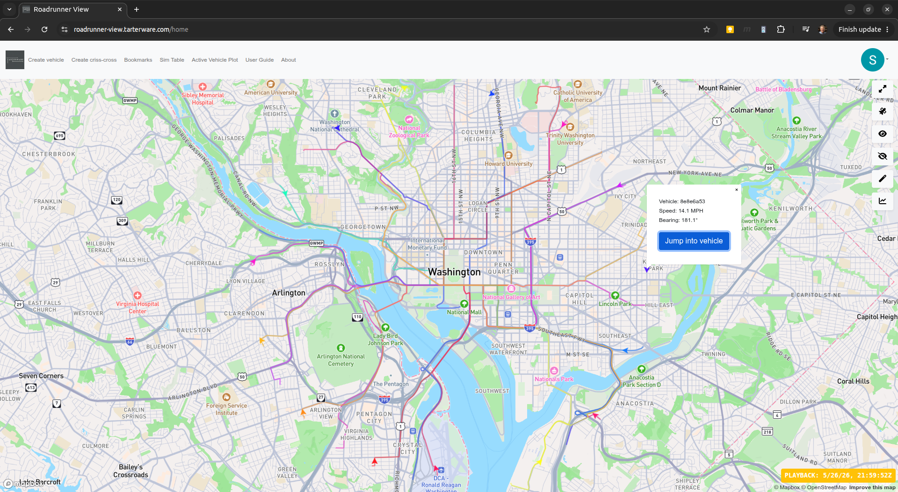
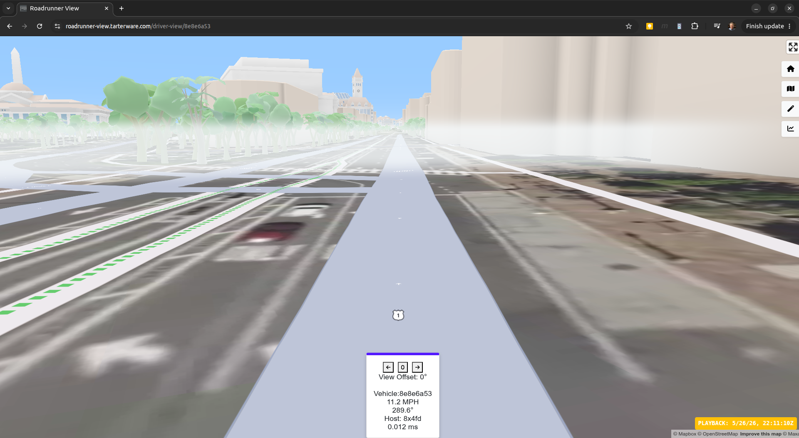

# Roadrunner Monorepo

Welcome to the **Roadrunner** monorepo! This repository consolidates the full Roadrunner simulation suite, including the backend engine, frontend viewer, and infrastructure orchestration components.

## Project Structure

The codebase is organized into the following directories:

*   **[`apps/roadrunner`](apps/roadrunner)**: The core backend simulation engine written in Java using Spring Boot and Maven. It performs real-time vehicle movement calculations, handles Mapbox API integration, manages the rest control plane, and publishes telemetry.
*   **[`apps/roadrunner-view`](apps/roadrunner-view)**: The frontend user interface written in React/TypeScript. It renders the simulated vehicles on a 2D/3D map (via Mapbox GL JS), provides driver-perspective rendering, and manages simulation controls.
*   **[`orchestration/roadrunner-k8s-orchestration`](orchestration/roadrunner-k8s-orchestration)**: The DevOps and infrastructure layer. It contains Terraform automation and Kubernetes manifests to deploy the entire suite to AWS EKS or a local Minikube environment, including Apache Kafka, Redis, and Prometheus setup.

---

## How It Works




1. **Simulation**: The backend **roadrunner** engine simulates vehicle movement based on routes fetched from the Mapbox Directions API and coordinate projection algorithms.
2. **Telemetry**: Position and status updates are published to **Kafka** topics (e.g., `vehicle.position.v1`).
3. **State Management**: The backend subscribes to the Kafka feed to build a fast, in-memory state store.
4. **Visualization**: The **roadrunner-view** React frontend queries the backend API for live positions and historical playback data and displays them dynamically on Mapbox map layers.

---

## Screenshots

**Interactive Map View (showing simulated vehicle positions and route tracks):**


**First-Person Driver's View (first-person perspective with other vehicles visible):**


---

## Quick Start

Detailed instructions for running and deploying each component can be found in their respective directories. Here is a high-level guide:

### Prerequisites
*   Java 17+ (for Backend)
*   Node.js 18+ and npm (for Frontend)
*   Docker & Kubernetes / Terraform (for Orchestration)
*   A Mapbox Access Token (required for both frontend map rendering and backend route generation)

### 1. Run the Backend
Go to the backend folder [`apps/roadrunner`](apps/roadrunner) and run the Spring Boot application:
```bash
# Set your Mapbox token
export MAPBOX_ACCESS_TOKEN="your-mapbox-token"

# Run locally using Maven (disabling Kafka by default for simple local setup)
./mvnw spring-boot:run -Dspring-boot.run.arguments="--roadrunner.messaging.kafka.enabled=false"
```

### 2. Run the Frontend
Go to the frontend folder [`apps/roadrunner-view`](apps/roadrunner-view) and launch the dev server:
```bash
# Install dependencies
npm install

# Run the app
npm start
```
Open [http://localhost:3000](http://localhost:3000) to view the map interface.

### 3. Local Development & Debugging with Minikube Infrastructure
You can run the required databases and messaging brokers locally inside Minikube to support development and debugging of code directly within your IDE:
*   The component [`orchestration/roadrunner-k8s-orchestration`](orchestration/roadrunner-k8s-orchestration) contains configuration manifests to install **Apache Kafka** and **Redis** inside a local **Minikube** cluster.
*   By starting these services in Minikube and forwarding their ports, you can run and debug the backend [`apps/roadrunner`](apps/roadrunner) application in your IDE connected to live Kafka and Redis environments.
*   See the deployment workflows inside [`orchestration/roadrunner-k8s-orchestration`](orchestration/roadrunner-k8s-orchestration) for detailed setup and port-forwarding instructions.
