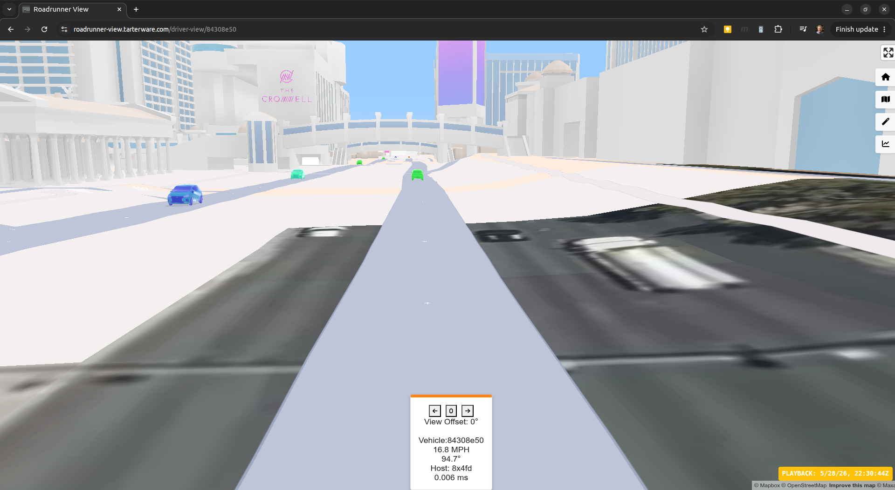
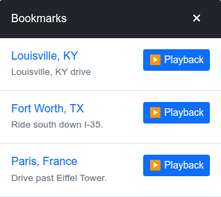
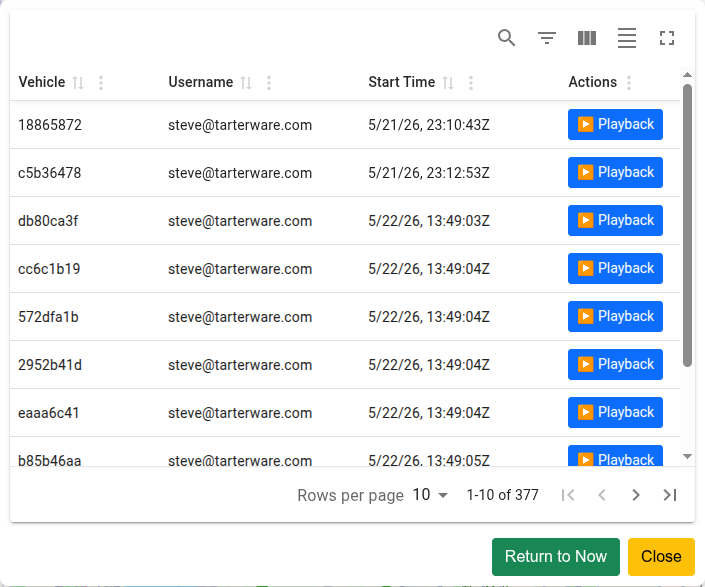
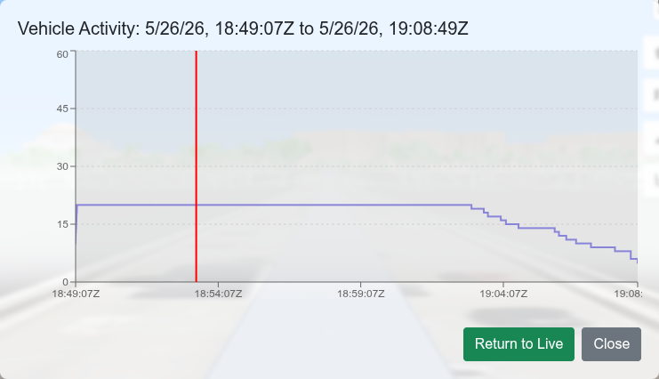

# Roadrunner View

> **Part of the [Roadrunner](https://github.com/SteveTarter/roadrunner) vehicle-simulation portfolio project.**

Roadrunner View is a **React / TypeScript** single-page application that provides a real-time, interactive map for monitoring and managing simulated vehicle fleets. It connects to the [Roadrunner backend](https://github.com/SteveTarter/roadrunner) over REST, renders vehicles on a **Mapbox GL** map with live interpolated movement, and lets users step into a first-person Driver's View for any vehicle — live or historical.

The project was built to gain hands-on, production-quality experience with a modern full-stack, cloud-native toolchain: React, TypeScript, Amazon Cognito / OIDC, Mapbox GL, Recharts, Docker, Nginx, and Kubernetes (via the companion [orchestration repo](https://github.com/SteveTarter/roadrunner-k8s-orchestration)).

---

## Table of Contents

- [Project Repositories](#project-repositories)
- [Screenshots](#screenshots)
- [Technology Stack](#technology-stack)
- [Architecture Overview](#architecture-overview)
- [Features](#features)
  - [Map View & Toolbar](#map-view--toolbar)
  - [Driver's View](#drivers-view)
  - [Playback & Monitoring](#playback--monitoring)
  - [Creator Features](#creator-features)
- [Authentication & Roles](#authentication--roles)
- [Prerequisites](#prerequisites)
- [Local Development Setup](#local-development-setup)
  - [1. Clone and Install](#1-clone-and-install)
  - [2. Configure Environment Variables](#2-configure-environment-variables)
  - [3. Run the Development Server](#3-run-the-development-server)
- [Docker Build & Run](#docker-build--run)
- [CI / CD](#ci--cd)
- [Project Structure](#project-structure)
- [Contributing](#contributing)
- [Privacy & Disclaimer](#privacy--disclaimer)

---

## Project Repositories

The Roadrunner system spans three repositories:

| Repository | Description |
|---|---|
| [roadrunner](https://github.com/SteveTarter/roadrunner) | Spring Boot backend — simulation engine, Kafka producer/consumer, REST API |
| **[roadrunner-view](https://github.com/SteveTarter/roadrunner-view)** *(this repo)* | React/TypeScript frontend viewer |
| [roadrunner-k8s-orchestration](https://github.com/SteveTarter/roadrunner-k8s-orchestration) | Terraform + Helm deployment to Minikube or AWS EKS |

---

## Screenshots

**Map view — 15-vehicle criss-cross pattern around The Ellipse, Washington D.C., with all routes visible:**


**Driver's View — first-person perspective from inside a vehicle:**


**Driver's View — other simulated vehicles visible on the road:**



---

## Technology Stack

| Concern | Technology |
|---|---|
| Language | TypeScript 4 |
| UI Framework | React 18, React Router 7 |
| Map rendering | Mapbox GL JS 3 (`react-map-gl`) |
| Geocoding / Search | `@mapbox/search-js-react` |
| Charts | Recharts 3 |
| Component library | MUI v9, React-Bootstrap 2, Reactstrap 9 |
| Authentication | Amazon Cognito (OIDC via `react-oidc-context`, `oidc-client-ts`) |
| AWS integration | AWS Amplify UI React |
| Build toolchain | Create React App (`react-scripts`) |
| Container runtime | Docker multi-stage build → Nginx 1.31 Alpine |
| CI/CD | GitHub Actions |

---

## Architecture Overview

```
Browser (React SPA)
    │
    │  REST / JSON polling
    ▼
Roadrunner Backend  ←──── Kafka ────►  Vehicle position stream
(Spring Boot)       ←──── Redis  ────► Cached route / trip plan data
    │
    │  Mapbox Directions API
    ▼
Mapbox Platform  (tile rendering, geocoding, routing)
```

The frontend is a **fully static SPA** once built. It communicates with the backend entirely through REST calls; there is no WebSocket connection. Vehicle positions are polled on a short interval and smoothly interpolated between known points for fluid on-screen movement.

The production container is a two-stage Docker image:
1. **Stage 1** — `node:22-alpine` builds the optimised `build/` bundle via `npm run build`.
2. **Stage 2** — `nginx:1.31-alpine` serves the static files, with security headers (CSP, HSTS, X-Frame-Options) baked into `nginx.conf`.

---

## Features

### Map View & Toolbar

The main page renders a full-screen Mapbox map with a floating toolbar pinned to the right edge. Each button toggles a behaviour:

| Button | Icon | Action |
|---|---|---|
| **Fit All** |  | Zoom/pan the map to frame all active vehicles |
| **Map Layers** |  | Toggle between street and satellite base maps |
| **Show / Hide Routes** |  | Globally show or hide the route line behind every vehicle. Individual vehicle routes can also be toggled by clicking near a vehicle marker. |
| **Interpolation** |  | Enable smooth animated movement between polled positions, or disable to observe raw data points |
| **Active Vehicle Chart** |  | Overlay a concurrency chart directly on the map |

### Driver's View

Click any vehicle on the Map View to open a panel to jump into a first-person street-level perspective rendered by Mapbox. Other simulated vehicles remain visible on the road ahead. The **Active Vehicle Chart** zooms automatically to the selected vehicle's lifetime so you can scrub backwards and forwards through its journey.

### Playback & Monitoring

Three top-navigation panels provide access to historical simulation data:

---
**Bookmarks** — a curated list of notable past simulation runs, each described by the administrator. Selecting an entry sets the application clock and launches the Driver's View for that vehicle's historical run.
  

---
**Sim Table** — a paginated table of every simulation session within the data-retention window. Columns include vehicle ID, initiating user, and start time. A **Now** button snaps the clock back to the current time; a **Play** button starts playback of any historical session.
  

---
**Active Vehicle Plot** — an interactive time-series chart showing the count of concurrent vehicle sessions across the retention window. Supports mouse-wheel or pinch zoom and click/double-tap to set the playback time.
  

  
When opened from the Driver's View the chart zooms automatically to the selected vehicle's lifetime.
  

---
### Creator Features
  
Users assigned to the `creator` group in Amazon Cognito (granted by the administrator) can launch up to 30 new simulation sessions per day via two additional panels:

---
**Create Vehicle** — specify an origin and destination via address auto-complete or by clicking directly on the map, then configure vehicle parameters and launch.
  

---
**Create Criss-Cross** — select a centre point on the map, choose a radius and vehicle count, and the system spawns vehicles evenly spaced around the circle, each routed to the diametrically opposite side. A preview circle appears on the map before generation.
  

    
After the Generate button has been depressed, vehicles are created as close as possible to the requested position.
  

---

## Authentication & Roles

Authentication is delegated entirely to **Amazon Cognito** via the OpenID Connect (OIDC) protocol (`react-oidc-context`). The application never handles passwords directly.

| Role | Access |
|---|---|
| Anonymous | Read-only map view (if the backend allows unauthenticated requests) |
| Authenticated user | Bookmarks, Sim Table, Active Vehicle Plot, Driver's View |
| `creator` group member | All of the above + Create Vehicle + Create Criss-Cross (up to 30 sessions/day) |

Membership of the `creator` group is managed in the Cognito User Pool by the administrator.

---

## Prerequisites

Before running locally you will need:

- **Node.js ≥ 18** (the Docker build uses Node 22)
- A running instance of the **[Roadrunner backend](https://github.com/SteveTarter/roadrunner)** (defaults to `http://localhost:8080`)
- A **[Mapbox](https://account.mapbox.com/auth/signup/)** account and public access token
- An **[Amazon AWS](https://aws.amazon.com/)** account with a **Cognito User Pool** and App Client configured for your redirect URLs

---

## Local Development Setup

### 1. Clone and Install

```bash
git clone https://github.com/SteveTarter/roadrunner-view.git
cd roadrunner-view
npm install
```

### 2. Configure Environment Variables

The application uses two `.env` files at the repository root:

#### `.env` (committed — non-sensitive defaults)

This file ships with sensible localhost defaults and is safe to commit:

```dotenv
REACT_APP_ROADRUNNER_REST_URL_BASE="http://localhost:8080"
REACT_APP_PUBLIC_URL="http://localhost:3000"
REACT_APP_MAPBOX_API_URL="https://api.mapbox.com/"
REACT_APP_LANDING_PAGE_URL="https://tarterware.com/"
REACT_APP_COGNITO_REDIRECT_SIGN_IN="http://localhost:3000/"
REACT_APP_COGNITO_REDIRECT_SIGN_OUT="http://localhost:3000/"
```

#### `.env.local` (git-ignored — sensitive secrets)

Create this file manually and add your real credentials. It is excluded from version control via `.gitignore`:

```dotenv
REACT_APP_MAPBOX_TOKEN="pk.your_mapbox_public_token"
REACT_APP_COGNITO_AUTHORITY="https://cognito-idp.<region>.amazonaws.com/<user-pool-id>"
REACT_APP_COGNITO_CLIENT_ID="your_cognito_app_client_id"
REACT_APP_COGNITO_REDIRECT_URI="http://localhost:3000/"
REACT_APP_COGNITO_USER_POOL_ID="<region>_xxxxxxxxx"
REACT_APP_COGNITO_USER_POOL_CLIENT_ID="your_cognito_app_client_id"
REACT_APP_COGNITO_DOMAIN="your-cognito-domain.auth.<region>.amazoncognito.com"
```

**Full variable reference:**

| Variable | Description |
|---|---|
| `REACT_APP_ROADRUNNER_REST_URL_BASE` | Base URL of the Roadrunner backend REST API |
| `REACT_APP_PUBLIC_URL` | Public URL of this frontend (used in auth redirects) |
| `REACT_APP_MAPBOX_API_URL` | Mapbox API base URL — should be `https://api.mapbox.com/` |
| `REACT_APP_LANDING_PAGE_URL` | Page to redirect to after sign-out |
| `REACT_APP_COGNITO_REDIRECT_SIGN_IN` | OAuth2 redirect URI registered in Cognito for sign-in |
| `REACT_APP_COGNITO_REDIRECT_SIGN_OUT` | OAuth2 redirect URI registered in Cognito for sign-out |
| `REACT_APP_MAPBOX_TOKEN` | Your Mapbox public access token |
| `REACT_APP_COGNITO_AUTHORITY` | OIDC issuer URL (Cognito User Pool endpoint) |
| `REACT_APP_COGNITO_CLIENT_ID` | Cognito App Client ID |
| `REACT_APP_COGNITO_REDIRECT_URI` | Full OIDC redirect URI (usually same as `COGNITO_REDIRECT_SIGN_IN`) |
| `REACT_APP_COGNITO_USER_POOL_ID` | Cognito User Pool ID (e.g. `us-east-1_AbCdEfGhI`) |
| `REACT_APP_COGNITO_USER_POOL_CLIENT_ID` | Cognito App Client ID (same as `CLIENT_ID` above) |
| `REACT_APP_COGNITO_DOMAIN` | Cognito hosted-UI domain |

> **Tip:** `REACT_APP_*` variables are embedded into the JavaScript bundle at **build time** by Create React App. For Docker deployments they must be passed as `--build-arg` values during `docker build` — they cannot be injected at container runtime.

### 3. Run the Development Server

```bash
npm start
```

The browser opens automatically at `http://localhost:3000`. The dev server supports hot reload. If it does not open automatically:

```bash
open http://localhost:3000/
```

---

## Docker Build & Run

The `Dockerfile` uses a two-stage build to produce a lean, production-ready image.

**Build** (pass env vars as build-args):

```bash
docker build \
  --build-arg REACT_APP_ROADRUNNER_REST_URL_BASE=http://your-backend:8080 \
  --build-arg REACT_APP_MAPBOX_TOKEN=pk.your_token \
  -t roadrunner-view:latest .
```

**Run:**

```bash
docker run -p 8081:80 roadrunner-view:latest
# Open http://localhost:8081/
```

The Nginx configuration in `nginx.conf` handles **SPA routing** (`try_files $uri /index.html`) so that React Router deep links work correctly without a `#` hash. It also sets the following security headers:

| Header | Value |
|---|---|
| `Content-Security-Policy` | Restricts scripts, styles, fonts, images, and connections to known-good origins (self, Mapbox, Cognito, AWS) |
| `Strict-Transport-Security` | `max-age=31536000; includeSubDomains` |
| `X-Frame-Options` | `DENY` |
| `X-Content-Type-Options` | `nosniff` |

---

## CI / CD

GitHub Actions workflows live in `.github/workflows/`. On merge to `main` the pipeline:

1. Builds the Docker image using the production env vars stored as GitHub Secrets.
2. Pushes the image to the container registry, tagged with the release version.

The [roadrunner-k8s-orchestration](https://github.com/SteveTarter/roadrunner-k8s-orchestration) repo references the published image tag when deploying to Minikube or AWS EKS via Terraform.

---

## Project Structure

```
roadrunner-view/
├── .env                        # Non-sensitive default env vars (committed)
├── .env.local                  # Secret env vars — create manually, git-ignored
├── Dockerfile                  # Two-stage Node → Nginx container build
├── nginx.conf                  # Nginx SPA routing + security headers
├── package.json
├── tsconfig.json
├── public/                     # Static HTML shell and favicon
├── src/
│   ├── App.tsx                 # Root router and OIDC provider setup
│   ├── components/
│   │   ├── DriverViewPage/     # First-person street-level vehicle view
│   │   ├── HomePage/           # Main map view with floating toolbar
│   │   ├── ProfilePage/        # Authenticated user profile
│   │   └── Utils/              # Shared helpers and utility components
│   └── models/                 # TypeScript interfaces and REST API helpers
├── Resources/
│   └── img/                    # Documentation screenshots
└── .github/
    └── workflows/              # GitHub Actions CI/CD pipelines
```

---

## Contributing

1. Fork the repository and create a feature branch: `git checkout -b feat/my-change`.
2. Follow the coding conventions in [AGENTS.md](AGENTS.md): functional React components, TypeScript, 2-space indent, single quotes, `PascalCase` for components, `camelCase` for hooks/utilities, `UPPER_SNAKE_CASE` for constants.
3. Add tests alongside changed code using the `*.test.tsx` / `*.test.ts` suffix.
4. Run the linter and test suite before opening a PR:
   ```bash
   npx eslint "src/**/*.{ts,tsx}"
   npx react-scripts test --watch=false
   npm run build
   ```
5. Include screenshots or GIFs for UI changes, and describe the verification steps in the pull-request body.

---

## Privacy & Disclaimer

Authentication is handled by Amazon Cognito via OpenID Connect. Roadrunner may receive basic account information (name, email, user ID) but never receives or stores passwords. The application uses cookies, browser storage, and authentication tokens to maintain sessions. Third-party services — Amazon Cognito, AWS, and Mapbox — may process limited technical data required for hosting, mapping, routing, and logging.

**Roadrunner is a demo portfolio project**, not a production transportation, dispatch, navigation, or safety system. It may change over time, contain bugs, or experience downtime. Do not enter confidential personal data. Roadrunner does not sell user data.
