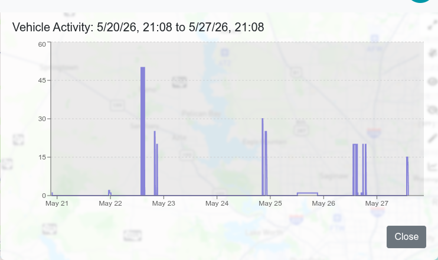
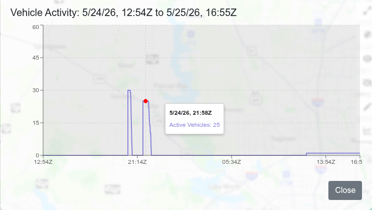

The Active Vehicle Plot displays a chart that shows the number of vehicles that have been run over the span of the retention period.  The X-axis is time, and the Y-axis is the number of concurrent sessions that were occuring at that time.

When invoked from the Home page, the plot opens with the plot zoomed out to show the entire retention period.  If invoked from the Driver's View page, the plot will automatically zoom in to the span of the selected vehicle's lifetime.

Below is a typical view after invoking from the Home Page:

You can zoom in on a particular run using the mouse wheel, or by using pinch gestures.  Zooming in allows easier selection of the specific time desired.  When the chart is clicked or double tapped, the playback time is set to that time.  Below shows the plot zoomed in:

When accessed from the Driver View, the Active Vehicle Plot zooms in to the time period that the selected vehicle ran.  This enables jumping back or forward in that vehicle's life, allowing "getting to the good part" easier.  Since criss-cross patterns are often centered on "interesting" places, this is useful.  Below is a typical Active Vehicle Plot accessed from the Driver Page.  The red vertical line shows the current playback time.

