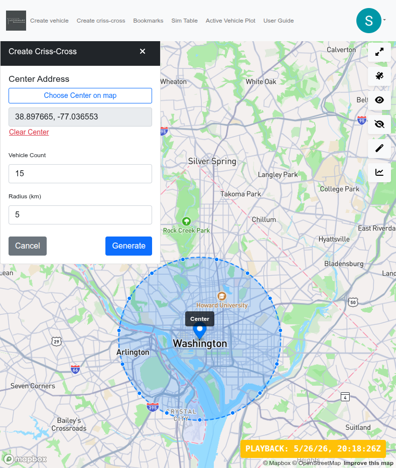
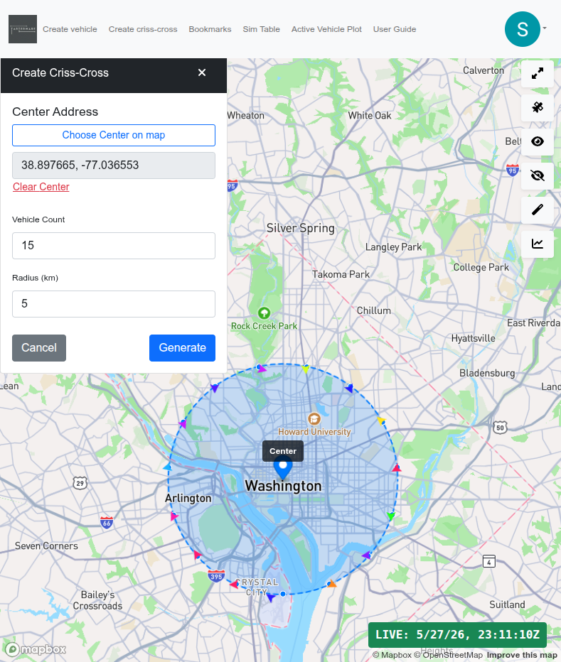

_Note: The following feature require your user account to be assigned to the 'creator' group in Amazon Cognito.  This access must be requested from the administrator.  Users in this group may create up to 30 sessions a day._

The Create Criss-Cross Panel allows a 'creator' user to start a number of vehicles at once.  The user specifies a center point by specifying an address or clicking on the map, the number of vehicles to start, and the radius of the circle.  Once the center has been selected, a circle appears on the map showing the selected radius.  Along the circle are dots that show where a vehicle will be created.

When the "Generate" button is pressed, vehicles will be created in the requested pattern.  Each vehicle is given a route that takes it from its starting point, through the center point, and ending at the point on the opposite side of the circle.

Pro Tip: Press the Generate button multiple times so you can watch a vehicle travel the route just in front of you.