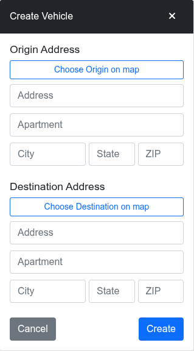

Create Vehicle Panel
====================
_Note: The following feature require your user account to be assigned to the 'creator' group in Amazon Cognito.  This access must be requested from the administrator.  Users in this group may create up to 30 sessions a day._

The Create Vehicle Panel allows a 'creator' user to request a simulation session.  The origin and destination may be specified by address or by clicking on a point on the map.

If specifying a point by address, autocomplete is used to aid choosing the point.  Alternately, you can click on "Choose Origin on map" (or "Destination") to specify the point.  Note that there are limitations; you can't specify a point far offshore, or points that span oceans.

Below is the Create Vehicle Panel:

