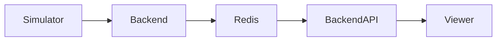
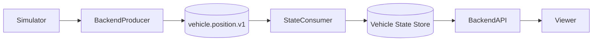

# Roadrunner Kafka Migration Design

**Status:** Proposed  
**Author:** Steve Tarter  
**Date:** 2026-03-16

---

## 1. Background

The Roadrunner platform simulates vehicle movement along routes and publishes vehicle position and orientation updates. These updates are currently written to Redis and consumed by backend APIs used by the viewer application.

Redis is currently serving two roles:

1. **Transport layer** for publishing vehicle position updates
2. **State store** for retrieving the latest vehicle state

While Redis works well as a fast key-value store, it is not designed to function as an event log or streaming platform.

Moving to Kafka introduces several advantages:

- Durable event streams
- Replayability for simulations
- Multiple consumers (analytics, storage, visualization)
- Improved decoupling between producers and consumers
- Better scaling for large vehicle fleets

Kafka is not designed to serve as a low-latency key-value lookup store. The system will therefore separate **event streaming** from **latest state storage**.

---

## 2. Goals

The migration introduces Kafka as the event streaming backbone for Roadrunner.

### Primary goals

- Replace Redis as the transport layer for vehicle telemetry
- Preserve existing REST APIs used by the viewer
- Maintain the ability to retrieve the latest vehicle state
- Enable replayable vehicle simulation streams
- Support multiple consumers in the future

### Secondary goals

- Maintain a unified deployment architecture across Minikube and EKS
- Introduce Strimzi to manage Kafka in Kubernetes
- Minimize disruption during migration

### Non-goals

- Removing Redis immediately
- Changing the viewer architecture
- Introducing schema registry or complex streaming pipelines initially

---

## 3. Current Architecture

Current flow:



Characteristics:

- Vehicle state is stored in Redis
- Backend APIs read vehicle state from Redis
- Viewer polls backend APIs

Limitations of current design:

- No event history
- No replay capability
- Tight coupling between producer and consumer
- Limited extensibility for analytics pipelines

---

## 4. Target Architecture

Kafka will be introduced as the streaming backbone while Redis temporarily remains as a compatibility layer.



Important points:

- Kafka becomes the authoritative event stream
- A consumer reconstructs the latest vehicle state
- Viewer remains unchanged initially
- Redis remains during migration but will be removed later

---

## 5. Kafka Topic Design

Primary topic:

```text
vehicle.position.v1
```

Message key:

```text
vehicleId
```

Using the vehicle ID as the key ensures ordering of events for each vehicle.

### Recommended topic configuration

| Setting | Value |
|---|---|
| Partitions | 6 initially |
| Replication factor | 1 (Minikube), 3 (EKS later) |
| Cleanup policy | delete |
| Retention | several days |

---

## 6. Event Schema

The Kafka message represents a single vehicle telemetry update.

Example event structure:

```json
{
  "vehicleId": "vehicle-123",
  "eventTime": "2026-03-16T20:10:00Z",
  "sequenceNumber": 14522,
  "latitude": 32.7688,
  "longitude": -97.3093,
  "heading": 142.5,
  "speed": 12.7,
  "status": "MOVING"
}
```

Java representation:

```java
public record VehiclePositionEvent(
    String vehicleId,
    Instant eventTime,
    long sequenceNumber,
    double latitude,
    double longitude,
    double heading,
    double speed,
    String status
) {}
```

Field descriptions:

| Field | Description |
|---|---|
| vehicleId | Unique vehicle identifier |
| eventTime | Timestamp of simulation event |
| sequenceNumber | Monotonic counter per vehicle |
| latitude | Vehicle latitude |
| longitude | Vehicle longitude |
| heading | Vehicle orientation |
| speed | Vehicle speed |
| status | Vehicle state |

JSON serialization will be used initially.

Future improvements may include:

- Avro schema
- Schema registry
- Versioned event contracts

---

## 7. Deployment Architecture

Kafka will be deployed using **Strimzi**.

Strimzi will run in both environments.

### Minikube

- Strimzi operator
- Single-broker Kafka cluster
- Ephemeral storage
- Internal cluster networking

### EKS

- Strimzi operator
- Initially 1 broker for proof of concept
- Persistent volumes
- Internal Kubernetes service exposure

---

## 8. Terraform Changes

The Terraform orchestration repository will be updated to deploy Kafka alongside Redis.

Migration-phase architecture:

```text
Terraform
 ├─ Redis (Helm)
 ├─ Strimzi Operator
 ├─ Kafka Cluster
 ├─ Kafka Topics
 └─ Backend Deployment
```

Backend environment variables will include:

```text
KAFKA_BOOTSTRAP_SERVERS
KAFKA_TOPIC_VEHICLE_POSITION
```

Redis variables remain temporarily:

```text
REDIS_HOST
REDIS_PORT
REDIS_PASSWORD
```

This allows both systems to operate simultaneously during migration.

---

## 9. Backend Changes

The backend service will introduce Kafka producer and consumer functionality.

### Kafka Producer

Publishes vehicle updates.

Example producer type:

```java
KafkaTemplate<String, VehiclePositionEvent>
```

Message key:

```text
vehicleId
```

### Kafka Consumer

Consumes vehicle events and maintains latest state.

Initial implementation:

```java
ConcurrentHashMap<String, VehiclePositionEvent>
```

Logic:

1. Compare event sequence numbers
2. Discard stale updates
3. Update latest state

Backend REST APIs read from this state store.

---

## 10. Viewer Impact

The viewer application will remain unchanged during migration.

Viewer flow remains:

```text
Viewer -> Backend REST APIs -> Latest Vehicle State
```

Future enhancements may include:

- WebSocket streaming
- Server-sent events
- Kafka-backed real-time updates

---

## 11. Migration Plan

### Phase 1 — Infrastructure

- Deploy Redis to both Minikube and EKS via Helm
- Deploy Strimzi operator
- Deploy Kafka cluster
- Create `vehicle.position.v1` topic

### Phase 2 — Backend Integration

- Add Kafka producer
- Continue writing to Redis
- Optional dual-write mode

### Phase 3 — State Consumer

- Implement Kafka consumer
- Build latest vehicle state from Kafka

### Phase 4 — Validation

- Compare Redis and Kafka state outputs
- Load-test simulation streams

### Phase 5 — Cutover

- Switch backend read path to Kafka-derived state
- Disable Redis writes

### Phase 6 — Redis Removal

- Remove Redis dependency from backend
- Remove Redis Helm module from Terraform

---

## 12. Risks

### Duplicate messages

Kafka may redeliver messages.

Mitigation:

- Use `sequenceNumber`
- Discard older events

### Out-of-order events

Ordering is guaranteed only per key.

Mitigation:

- Key by `vehicleId`

### Infrastructure complexity

Kafka introduces operational overhead.

Mitigation:

- Use the Strimzi operator
- Start with a minimal cluster

---

## 13. Future Improvements

### Streaming analytics

Possible consumers:

- Traffic density
- Congestion detection
- Route analysis

### Data archival

Kafka consumer writing to:

- S3
- A time-series database

### Real-time viewer updates

Instead of polling:

- WebSocket streaming
- Kafka-to-WebSocket bridge

### Schema evolution

Introduce:

- Avro schemas
- Schema registry

---

## 14. Summary

This migration introduces Kafka as the Roadrunner event streaming backbone while maintaining existing APIs and viewer functionality.

Key principles:

- Separate event streaming from state storage
- Migrate incrementally
- Maintain environment symmetry
- Minimize disruption to existing components

Once the Kafka event pipeline is validated, Redis will be removed and the system will rely fully on Kafka-driven state reconstruction.
